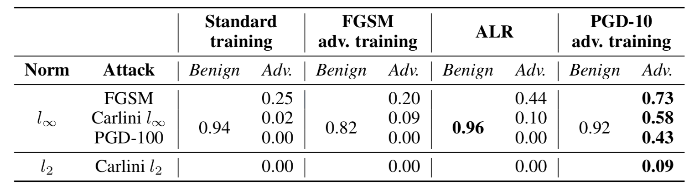
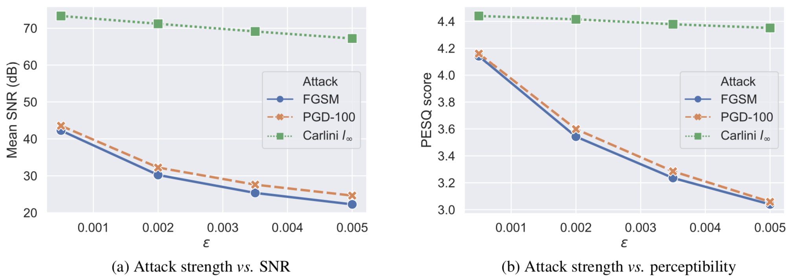
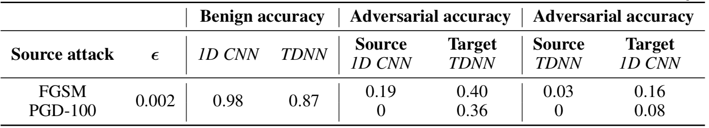

# Adversarial attack and defense strategies for deep speaker recognition systems

This repository contains the source codes for performing time-domain adversarial attack on a deep neural network based speaker recognition model. It also provides implementation of defense methods via adversarial training and adversarial Lipschitz regularization [1]. The core implementation of the attack and defense algorithms is based on the [Adversarial Robustness Toolbox (ART)](https://github.com/Trusted-AI/adversarial-robustness-toolbox) and the original implementation of [1].


# Expository analyses
We perform extensive analyses on adversarial attack and defense strategies for a deep speaker recognition model. 

## Features
 - Time-domain adversarial attack
 - Extensive analysis of the effect of multiple state-of-the-art white box adversarial attacks on a DNN-based speaker recognition model. **Algorithms:** `FGSM [2], PGD [3], and Carlini-Wagner [4]`
 - Multiple defensive countermeasures for the deep speaker recognition system, and detailed comparison. **Algorithms:** `adversarial training [2,3], adversarial Lipschitz regularization (ALR) [1]`
 - Transferability analysis
 - Various ablation studies (_e.g._, varying the strength of the attack, measuring signal-to-noise ratio (SNR) and perceptibility of the adversarial speech samples via PESQ scores [5])

## Key findings

### Main results
Accuracy scores ([0,1] scale) for the undefended model (standard training), and three defense methods against several state-of-the-art adversarial attacks.


### Attack strength _vs._ SNR _vs._ perceptibility


### Transferability


# Paper (arXiv preprint)
More detailed information about the experiments can be found in the paper:
**ARXIV_LINK**
Please cite us if you find the paper/source code useful.
**CITATION ARXIV**


# Installation
Create your virtual env, and then install the dependencies.
```
conda create -n adv_spkr python=3.6
conda activate adv_spkr
```

First, install [pytorch 1.4.0](https://pytorch.org/get-started/previous-versions/#v140) yourself depending on the configuration and GPU availability of your machine. Then,

```
pip install -r requirements.txt
```

## Tested in
- CentOS Linux release 7.7.1908 (Core)
- python 3.6

# Usage

## Data preparation: [LibriSpeech](http://www.openslr.org/12/)
Please download LibriSpeech `train-clean-100` dataset from http://www.openslr.org/12/, and extract (uncompress) it. This should extract everything in a directory named `LibriSpeech/`.

Set `data_root` in `hparams.py`
e.g.,
`self.data_root = /data/speech` if `/data/speech/` contains the extracted `LibriSpeech/` folder.

## Attack

### Example bash script
It might be easier to just look at the following bash script, and execute it with the default / other suitable parameters.
```
sh run.sh
```

Otherwise, you can also directly work with the python scripts as shown below.

### Standard training / no defense
```
model_dir=models/
mkdir -p $model_dir
MODEL_CKPT=${model_dir}/model.pt

OUTPUT_DIR=outputs/
mkdir -p $OUTPUT_DIR

MODEL_TYPE=cnn

python train_libri.py \
  --model_type $MODEL_TYPE \
  --model_ckpt $MODEL_CKPT \
  --batch_size 128 \
  --num_workers 16 \
  --n_epochs 30 \
  --log $OUTPUT_DIR/results_train.txt

```

### Test with different adversarial attacks
```
ATTACK=FastGradientMethod
EPS=0.002
python test_libri.py \
  --model_type $MODEL_TYPE \
  --model_ckpt $MODEL_CKPT \
  --output_dir $OUTPUT_DIR \
  --attack $ATTACK \
  --epsilon $EPS \
  --report $OUTPUT_DIR/report.md \
  --log $OUTPUT_DIR/results_test.txt

```
`--model_ckpt` should point to the pre-trained model we just trained above.

Other `ATTACK` options are: `ProjectedGradientDescent, CarliniLInfMethod, CarliniL2Method`.

Add `--save_wav 1` if you want to save the adversarial examples.
The output adversarial samples can be found in `$OUTPUT_DIR`.

## Defense

### Example bash script
```
run_defence.sh
```

Or, work with the python scripts as shown below.

### Adversarial training 
```
MODEL_TYPE=cnn
DEF_OUTPUT_DIR=defense_outputs
mkdir -p $DEF_OUTPUT_DIR
DEF_MODEL_CKPT=$DEF_OUTPUT_DIR/model.pt

python train_adversarial_libri.py \
  --model_type $MODEL_TYPE \
  --model_ckpt $DEF_MODEL_CKPT \
  --num_epochs 30 \
  --epsilon 0.002 \
  --ratio 0.5 \
  --attack_max_iter 10 \
  --attack ProjectedGradientDescent \
  --log $DEF_OUTPUT_DIR/results_train.txt
```

### Adversarial Lipschitz regularization (ALR)
```
ALR_WEIGHT=1
N_ITERS=500000
python train_libri.py \
  --model_type $MODEL_TYPE \
  --model_ckpt $DEF_MODEL_CKPT \
  --batch_size 128 \
  --alr_weight $ALR_WEIGHT \
  --n_iters $N_ITERS \
  --num_workers 32 \
  --log $DEF_OUTPUT_DIR/results_train.txt

```

### Test with different adversarial attacks
Same as testing an undefended model, just use the defended pre-trained model path in `--model_ckpt=$DEF_MODEL_CKPT`.

## Transferability analysis

#### Example bash script
```
sh run_tdnn_transfer.sh
```

Or the following step-by-step guide.

Train a source model `SRC_MODEL_CKPT` with standard training as described above.

### Standard training of a target TDNN model
```
TGT_MODEL_CKPT=models/tdnn-model.pt
OUTPUT_DIR=transfer_expt/
mkdir -p $OUTPUT_DIR

python train_libri.py \
  --model_type tdnn \
  --model_ckpt $TGT_MODEL_CKPT \
  --batch_size 128 \
  --num_workers 16 \
  --n_epochs 3 \
  --log $OUTPUT_DIR/results_train.txt
```

### Run transferability script
```
python transfer_test.py \
  --model_ckpt $SRC_MODEL_CKPT \
  --target_model_ckpt $TGT_MODEL_CKPT \
  --output_dir $OUTPUT_DIR \
  --attack $ATTACK \
  --epsilon $EPS \
  --attack_max_iter $MAX_ITER \
  --report $REPORT \
  --log $OUTPUT_DIR/results_transfer_test.txt

```


# References
[1] Dávid Terjék. Adversarial lipschitz regularization. In 8th International Conference on Learning Representations, ICLR 2020, Addis Ababa, Ethiopia, April 26-30, 2020. OpenReview.net, 2020.  
[2] Ian Goodfellow, Jonathon Shlens, and Christian Szegedy. Explaining and harnessing adversarial examples. In International Conference on Learning Representations, 2015.  
[3] Aleksander Madry, Aleksandar Makelov, Ludwig Schmidt, Dimitris Tsipras, and Adrian Vladu. Towards deep learning models resistant to adversarial attacks. In International Conference on Learning Representations, 2018.  
[4] Nicholas Carlini and David Wagner. Towards evaluating the robustness of neural networks. In 2017 IEEE symposium on security and privacy (sp), pages 39–57. IEEE, 2017.  
[5] ITU-T Recommendation. Perceptual evaluation of speech quality (pesq): An objective method for end-to-end speech quality assessment of narrow-band telephone networks and speech codecs. Rec. ITU-T P. 862, 2001.  

